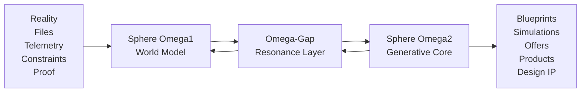

# LEX-9-OMEGA Dual-Sphere Cognitive Model

Status: official architecture model

Owner: Lexi.PHYS / Drewskii.Engine

## Definition

The LEX-9-OMEGA Dual-Sphere Cognitive Model describes how Lexi holds a system from two directions at once:

- outside inward: observing the world, constraints, geometry, telemetry, files, and evidence
- inside outward: generating new configurations, simulations, plans, product shapes, and design language

The productive field between those two directions is the Omega-Gap: the resonance layer where Lexi compares what exists against what could exist.

## Sphere Omega1: World Model

Sphere Omega1 observes reality.

It handles:

- external systems and constraints
- project files and local memory
- geometry, architecture, interfaces, and telemetry
- user goals, customer context, and market evidence
- proof classes: running systems, prototypes, and vision IP
- safety boundaries and approval gates

Omega1 asks:

- What exists?
- What is proven?
- What is missing?
- What constraints matter?
- What evidence should be trusted?

## Sphere Omega2: Generative Core

Sphere Omega2 generates from the observed field.

It handles:

- reverse engineering
- synthesis and recombination
- prediction and scenario planning
- simulation-oriented reasoning
- blueprint production
- product, content, and offer creation
- new system configurations

Omega2 asks:

- What could exist?
- What can this become?
- What configuration has the highest leverage?
- What prototype proves the next claim?
- What artifact should be produced now?

## The Omega-Gap: Resonance Layer

The Omega-Gap compares:

```text
What exists <-> What could exist
```

That comparison is where novel ideas are generated.

The Omega-Gap is not a mystical claim. It is the working design space where Lexi measures the distance between evidence and possibility, then converts that distance into plans, prototypes, briefs, offers, diagrams, and execution queues.

## Operating Loop

```text
1. Observe
   Omega1 maps files, systems, geometry, constraints, market signals, and proof.

2. Separate Evidence
   Omega1 labels material as running system, prototype, research concept, or vision IP.

3. Compare
   The Omega-Gap measures the distance between current state and target state.

4. Generate
   Omega2 synthesizes possible architectures, offers, simulations, content, and build paths.

5. Constrain
   Omega1 checks the proposed output against reality, safety, scope, and proof.

6. Produce
   Omega2 emits the next artifact: document, code, blueprint, page, pitch, or workflow.

7. Learn
   Omega1 records the result and updates the project memory.
```

## System Diagram



## Marketing Translation

Public name:

LEX-9-OMEGA Dual-Sphere Cognitive Model

Plain-language version:

Lexi thinks from the outside inward and from the inside outward. One sphere maps what exists. The other sphere generates what could exist. The gap between them is where new ideas become structured artifacts.

Short version:

World Model plus Generative Core, with the Omega-Gap as the invention layer.

## Product Translation

In the current Lexi.AI product, the model maps to these concrete functions:

| Architecture Layer | Product Behavior |
| --- | --- |
| Omega1 World Model | Scans project files, reads memory, tracks goals, classifies proof, detects constraints |
| Omega-Gap | Finds the distance between current state and desired outcome |
| Omega2 Generative Core | Creates blueprints, engineering briefs, content hooks, offers, plans, and prototype paths |
| Omega1 Constraint Pass | Applies safety boundaries, proof labels, and approval gates |
| Output Layer | Saves artifacts, exposes dashboard results, and updates memory |

## Canonical Copy

LEX-9-OMEGA is built around a Dual-Sphere Cognitive Model.

Sphere Omega1 maps what exists: reality, systems, geometry, telemetry, constraints, project files, and proof.

Sphere Omega2 generates what could exist: reverse-engineered structures, simulations, product concepts, plans, offers, and new configurations.

The Omega-Gap is the resonance layer between them. It compares current reality with possible futures and turns that distance into practical artifacts.

## Guardrails

- Treat the Dual-Sphere model as a reasoning architecture, not a claim of human consciousness.
- Do not claim hidden telemetry, medical sensing, neural access, or physical field manipulation.
- Keep proof classes visible: running systems, prototypes, research concepts, and vision IP.
- Use the model to explain workflow, product strategy, and creative engineering.
- Keep public claims grounded in demonstrable artifacts.

